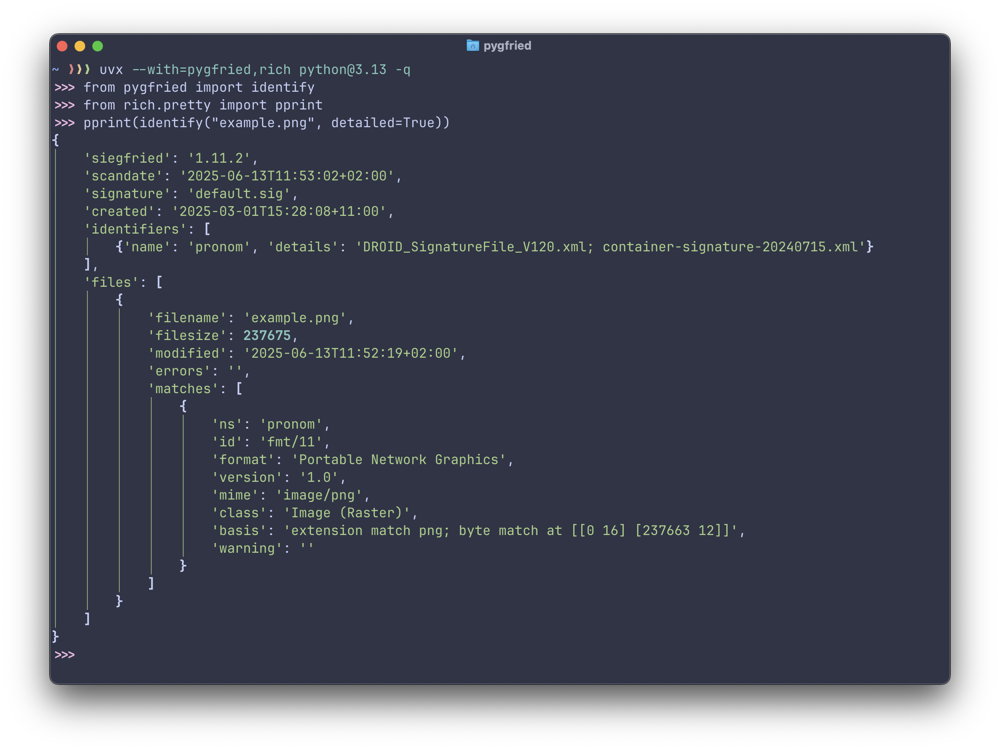

[](https://badge.fury.io/py/pygfried)

# Pygfried

pygfried is a CPython extension that brings [siegfried] - a powerful,
signature-based file format identification tool written in Go - into the Python
ecosystem.



Instead of reimplementing siegfried's logic, pygfried embeds the original Go
code directly, making core siegfried functionality available to Python users
without any changes to the underlying detection engine.

No animals were harmed in the making of this extension.

## Usage

```
$ pip install pygfried
$ python -q
>>> import pygfried
>>> pygfried.version()
'1.11.2'
>>> pygfried.identify("example.png")
'fmt/11'
>>> pygfried.identify("example.png", detailed=True)
{'siegfried': '1.11.2', 'scandate': '2025-06-10T07:16:31+02:00', 'signature': 'default.sig', 'created': '2025-03-01T15:28:08+11:00', 'identifiers': [{'name': 'pronom', 'details': 'DROID_SignatureFile_V120.xml; container-signature-20240715.xml'}], 'files': [{'filename': 'example.png', 'filesize': 237675, 'modified': '2025-06-10T07:11:26+02:00', 'errors': '', 'matches': [{'ns': 'pronom', 'id': 'fmt/11', 'format': 'Portable Network Graphics', 'version': '1.0', 'mime': 'image/png', 'class': 'Image (Raster)', 'basis': 'extension match png; byte match at [[0 16] [237663 12]]', 'warning': ''}]}]}
>>> pygfried.identify_many(["example.png", "README.md"], workers=2)
{'siegfried': '1.11.2', ...}
>>> pygfried.identify_dir("samples", recursive=True, workers=2)
{'siegfried': '1.11.2', ...}
```

### Batch and directory scans

Use `identify_many` when you already have a list of paths, or `identify_dir`
when you want pygfried to scan a directory for you. Both functions return the
same detailed result shape as `identify(..., detailed=True)`.

```
>>> from pathlib import Path
>>> paths = [str(path) for path in Path("samples").rglob("*.png")]
>>> pygfried.identify_many(paths, workers=4)
{'siegfried': '1.11.2', ...}
>>> pygfried.identify_dir("samples", recursive=True, workers=4)
{'siegfried': '1.11.2', ...}
```

The `workers` argument controls Go-side concurrency. The default is `1`, which
is the most conservative setting. For directories or large path lists, higher
values can be much faster because pygfried avoids repeated Python-to-Go calls
and identifies multiple files in parallel. A good starting point is the number
of CPU cores available to your process, then measure with your own files.

By default `identify_dir` skips symlinks. Use `follow_symlinks=True` to
identify file symlinks and descend symlinked directories; directory cycles are
skipped, and repeated links to the same directory are scanned once.

## Limitations

### Go libraries can clash

This project uses Go's `-buildmode=c-shared` to provide its Python extension.
Loading multiple Go-based shared libraries in the same process is [unsupported]
and may result in panics or crashes due to conflicts between separate Go runtimes.

This limitation should only affect you if you're using pygfried together with
another Python library that also uses a Go extension (built with the same
c-shared mechanism) in the same process. If you're just using pygfried on its
own, you don't need to worry - everything should work as expected.

## Credits

pygfried is powered by the original [siegfried] project, which is distributed
under the Apache License, Version 2.0. All core file format identification logic
and signatures are provided by siegfried. We gratefully acknowledge the work of
the siegfried project and its contributors.

[siegfried]: https://www.itforarchivists.com/siegfried
[unsupported]: https://github.com/golang/go/issues/65050
