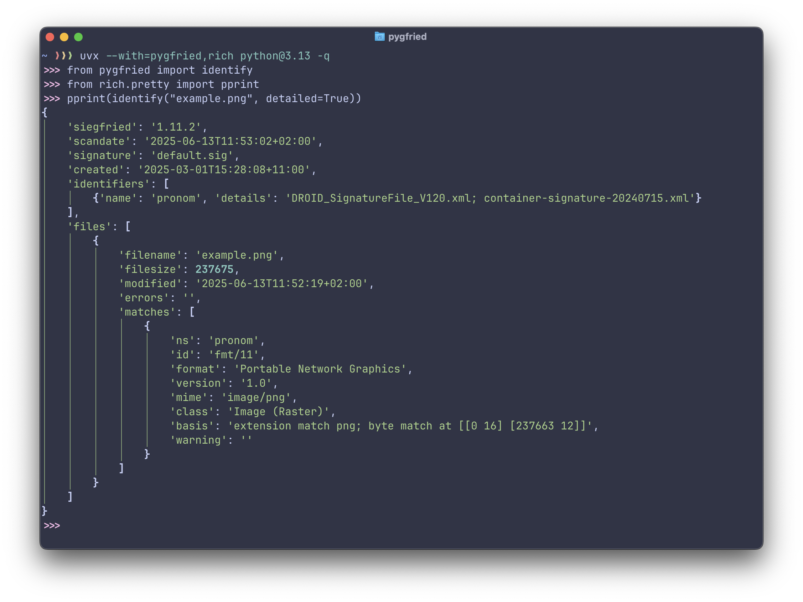

[](https://badge.fury.io/py/pygfried)

# Pygfried

pygfried is a CPython extension that brings [siegfried] - a powerful,
signature-based file format identification tool written in Go - into the Python
ecosystem.



Instead of reimplementing siegfried's logic, pygfried embeds the original Go
code directly, making core siegfried functionality available to Python users
without any changes to the underlying detection engine.

No animals were harmed in the making of this extension.

## Usage

```
$ pip install pygfried
$ python -q
>>> import pygfried
>>> pygfried.version()
'1.11.6'
>>> pygfried.identify("example.png")
'fmt/11'
>>> pygfried.identify("example.png", detailed=True)
{'siegfried': '1.11.6', 'scandate': '2025-06-10T07:16:31+02:00', 'signature': 'default.sig', 'created': '2025-03-01T15:28:08+11:00', 'identifiers': [{'name': 'pronom', 'details': 'DROID_SignatureFile_V124.xml; container-signature-20260119.xml'}], 'files': [{'filename': 'example.png', 'filesize': 237675, 'modified': '2025-06-10T07:11:26+02:00', 'errors': '', 'matches': [{'ns': 'pronom', 'id': 'fmt/11', 'format': 'Portable Network Graphics', 'version': '1.0', 'mime': 'image/png', 'class': 'Image (Raster)', 'basis': 'extension match png; byte match at [[0 16] [237663 12]]', 'warning': ''}]}]}
>>> pygfried.identify_many(["example.png", "README.md"], workers=2)
{'siegfried': '1.11.6', ...}
>>> pygfried.identify_dir("samples", recursive=True, workers=2)
{'siegfried': '1.11.6', ...}
```

The module-level functions always use Siegfried's embedded `default.sig`. Use a
`Scanner` when you need another signature database:

```python
import pygfried

scanner = pygfried.Scanner(profile="archivematica")
scanner.identify("disk-image.ad1")
# 'archivematica-fmt/2'

result = scanner.identify("disk-image.ad1", detailed=True)
assert result["signature"] == "archivematica.sig"
```

Available bundled profiles are:

- `default`, which is also selected by `Scanner()` and matches the behavior of
  the module-level functions.
- `archivematica`, which contains the complete PRONOM database plus
  Archivematica's extended identifiers for AD1, encrypted AD1, raw disk images,
  and AFF.

The Archivematica database is copied from the exact Siegfried module version
used to compile pygfried. It is embedded in the extension, so it does not need
to be installed separately.

To use another complete Siegfried signature database, pass its path:

```python
scanner = pygfried.Scanner(signature="/usr/share/siegfried/custom.sig")
```

`profile` and `signature` are keyword-only and mutually exclusive. External
databases are validated and loaded into memory when the scanner is constructed;
changing or deleting the file afterward does not change that scanner. The
read-only `scanner.profile` and `scanner.signature` properties report the
selected source.

### Batch and directory scans

Use `identify_many` when you already have a list of paths, or `identify_dir`
when you want pygfried to scan a directory for you. Both functions return the
same detailed result shape as `identify(..., detailed=True)`.

```
>>> from pathlib import Path
>>> paths = [str(path) for path in Path("samples").rglob("*.png")]
>>> pygfried.identify_many(paths, workers=4)
{'siegfried': '1.11.6', ...}
>>> pygfried.identify_dir("samples", recursive=True, workers=4)
{'siegfried': '1.11.6', ...}
```

The `workers` argument controls Go-side concurrency. The default is `1`, which
is the most conservative setting. For directories or large path lists, higher
values can be much faster because pygfried avoids repeated Python-to-Go calls
and identifies multiple files in parallel. A good starting point is the number
of CPU cores available to your process, then measure with your own files.

By default `identify_dir` skips symlinks. Use `follow_symlinks=True` to
identify file symlinks and descend symlinked directories; directory cycles are
skipped, and repeated links to the same directory are scanned once.

### Concurrency

A `Scanner` is safe to reuse across threads. Each scanner owns an independent,
immutable Siegfried engine, while each `identify_many` or `identify_dir` call
controls its own Go-side concurrency with `workers`. There is no process-wide
worker limit beyond the per-call range of 1 to 1024.

Create scanners after a process forks rather than attempting to serialize or
transfer them between processes.

## Limitations

### Go libraries can clash

This project uses Go's `-buildmode=c-shared` to provide its Python extension.
Loading multiple Go-based shared libraries in the same process is [unsupported]
and may result in panics or crashes due to conflicts between separate Go runtimes.

This limitation should only affect you if you're using pygfried together with
another Python library that also uses a Go extension (built with the same
c-shared mechanism) in the same process. If you're just using pygfried on its
own, you don't need to worry - everything should work as expected.

## Credits

pygfried is powered by the original [siegfried] project, which is distributed
under the Apache License, Version 2.0. All core file format identification logic
and signatures are provided by siegfried. We gratefully acknowledge the work of
the siegfried project and its contributors.

[siegfried]: https://www.itforarchivists.com/siegfried
[unsupported]: https://github.com/golang/go/issues/65050
